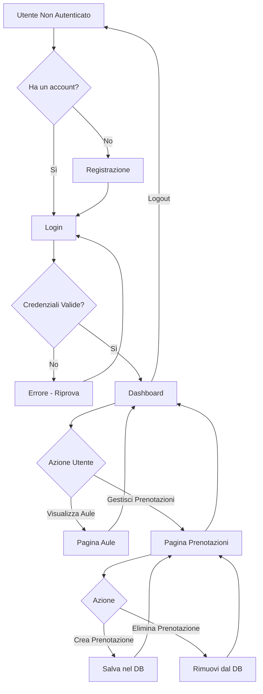

# 🏫 ClassBook - Sistema di Prenotazione Aule

<div align="center">


**Un sistema moderno e intuitivo per la gestione delle prenotazioni delle aule scolastiche**

[](https://nodejs.org/)
[](https://expressjs.com/)
[](https://www.mysql.com/)
[](LICENSE)

[Caratteristiche](#-caratteristiche) •
[Demo](#-demo) •
[Installazione](#-installazione) •
[Utilizzo](#-utilizzo) •
[Tecnologie](#-tecnologie-utilizzate) •
[Contribuire](#-contribuire)

</div>

---

## 📋 Indice

- [Panoramica](#-panoramica)
- [Caratteristiche](#-caratteristiche)
- [Demo](#-demo)
- [Prerequisiti](#-prerequisiti)
- [Installazione](#-installazione)
- [Configurazione Database](#-configurazione-database)
- [Utilizzo](#-utilizzo)
- [Struttura del Progetto](#-struttura-del-progetto)
- [Flusso Applicativo](#-flusso-applicativo)
- [Tecnologie Utilizzate](#-tecnologie-utilizzate)
- [Sicurezza](#-sicurezza)
- [Roadmap](#-roadmap)
- [Contribuire](#-contribuire)
- [Licenza](#-licenza)
- [Contatti](#-contatti)

---

## 🌟 Panoramica

**ClassBook** è un'applicazione web full-stack progettata per semplificare la gestione delle prenotazioni delle aule in ambiente scolastico o universitario. Con un'interfaccia moderna e intuitiva, gli utenti possono facilmente visualizzare le aule disponibili, effettuare prenotazioni e gestire i propri impegni.

### Perché ClassBook?

- ✅ **Semplice da usare**: Interfaccia pulita e intuitiva
- ✅ **Sicuro**: Autenticazione robusta con bcrypt
- ✅ **Responsive**: Funziona perfettamente su tutti i dispositivi
- ✅ **Moderno**: Design professionale con animazioni fluide
- ✅ **Efficiente**: Gestione ottimizzata delle prenotazioni

---

## ✨ Caratteristiche

### 🔐 Autenticazione
- **Registrazione utenti** con validazione password
- **Login sicuro** con hashing bcrypt
- **Gestione sessioni** server-side
- **Logout protetto**

### 📚 Gestione Aule
- Visualizzazione di tutte le aule disponibili
- Informazioni dettagliate sulla capienza
- Layout a griglia responsive
- Interfaccia visivamente accattivante con icone

### 📅 Prenotazioni
- **Crea nuove prenotazioni** selezionando aula e data
- **Visualizza prenotazioni** personali in tempo reale
- **Elimina prenotazioni** con conferma di sicurezza
- **Stati vuoti** informativi quando non ci sono prenotazioni

### 🎨 Design Moderno
- Palette colori professionale (indigo/purple gradient)
- Animazioni fluide e transizioni smooth
- Hover effects interattivi
- Font moderno (Inter)
- Completamente responsive

---

## 🎬 Demo

### Pagina di Login
```
┌─────────────────────────────────────┐
│  🏫 ClassBook                       │
│                                     │
│  Benvenuto su ClassBook             │
│  Accedi al tuo account per          │
│  gestire le prenotazioni            │
│                                     │
│  ┌─────────────────────────────┐   │
│  │ Username                    │   │
│  └─────────────────────────────┘   │
│                                     │
│  ┌─────────────────────────────┐   │
│  │ Password                    │   │
│  └─────────────────────────────┘   │
│                                     │
│  [        Accedi        ]           │
│                                     │
│  Non hai un account? Registrati     │
└─────────────────────────────────────┘
```

### Dashboard
```
┌─────────────────────────────────────┐
│  Dashboard                          │
│  Gestisci le tue prenotazioni       │
│                                     │
│  ┌──────────┐    ┌──────────┐      │
│  │   🏫     │    │   📋     │      │
│  │  Aule    │    │ Prenot.  │      │
│  │ Disponi. │    │   Mie    │      │
│  └──────────┘    └──────────┘      │
└─────────────────────────────────────┘
```

---

## 📦 Prerequisiti

Prima di iniziare, assicurati di avere installato:

- **Node.js** (v14 o superiore)
- **npm** (v6 o superiore)
- **MySQL** (v8.0 o superiore)
- Un editor di codice (consigliato: VS Code)

---

## 🚀 Installazione

### 1. Clona il Repository

```bash
git clone https://github.com/tuousername/classbook.git
cd classbook
```

### 2. Installa le Dipendenze

```bash
npm install
```

### 3. Configura il Database

Crea un database MySQL chiamato `classbook`:

```sql
CREATE DATABASE classbook;
USE classbook;
```

Crea le tabelle necessarie:

```sql
-- Tabella utenti
CREATE TABLE users (
  id INT AUTO_INCREMENT PRIMARY KEY,
  username VARCHAR(50) UNIQUE NOT NULL,
  password VARCHAR(255) NOT NULL,
  role VARCHAR(20) DEFAULT 'user',
  created_at TIMESTAMP DEFAULT CURRENT_TIMESTAMP
);

-- Tabella aule
CREATE TABLE rooms (
  id INT AUTO_INCREMENT PRIMARY KEY,
  name VARCHAR(100) NOT NULL,
  capacity INT NOT NULL,
  created_at TIMESTAMP DEFAULT CURRENT_TIMESTAMP
);

-- Tabella prenotazioni
CREATE TABLE bookings (
  id INT AUTO_INCREMENT PRIMARY KEY,
  user_id INT NOT NULL,
  room_id INT NOT NULL,
  booking_date DATE NOT NULL,
  created_at TIMESTAMP DEFAULT CURRENT_TIMESTAMP,
  FOREIGN KEY (user_id) REFERENCES users(id) ON DELETE CASCADE,
  FOREIGN KEY (room_id) REFERENCES rooms(id) ON DELETE CASCADE
);
```

### 4. Inserisci Dati di Esempio (Opzionale)

```sql
-- Aggiungi alcune aule di esempio
INSERT INTO rooms (name, capacity) VALUES
('Aula Informatica A', 30),
('Aula Magna', 150),
('Laboratorio Scienze', 25),
('Aula 101', 40),
('Sala Conferenze', 80);
```

### 5. Configura la Connessione al Database

Modifica il file `db.js` con le tue credenziali MySQL:

```javascript
const pool = mysql.createPool({
  host: 'localhost',
  user: 'tuousername',      // Cambia con il tuo username
  password: 'tuapassword',  // Cambia con la tua password
  database: 'classbook'
});
```

### 6. Avvia l'Applicazione

```bash
node app.js
```

oppure con nodemon per il development:

```bash
npx nodemon app.js
```

L'applicazione sarà disponibile su: **http://localhost:3000**

---

## 📖 Utilizzo

### 1️⃣ Registrazione

1. Naviga su **http://localhost:3000**
2. Clicca su **"Registrati qui"**
3. Compila il form con:
   - Username (univoco)
   - Password (sicura)
   - Conferma password
4. Clicca su **"Registrati"**

### 2️⃣ Login

1. Inserisci le tue credenziali
2. Clicca su **"Accedi"**
3. Verrai reindirizzato alla Dashboard

### 3️⃣ Visualizzare le Aule

1. Dalla Dashboard, clicca su **"Aule Disponibili"**
2. Visualizza tutte le aule con le rispettive capienze
3. Torna alla Dashboard quando vuoi

### 4️⃣ Creare una Prenotazione

1. Dalla Dashboard, clicca su **"Le Mie Prenotazioni"**
2. Scorri fino alla sezione **"Nuova Prenotazione"**
3. Seleziona un'aula dal menu a tendina
4. Scegli una data dal calendario
5. Clicca su **"Prenota Ora"**

### 5️⃣ Gestire le Prenotazioni

1. Visualizza tutte le tue prenotazioni nella pagina **"Le Mie Prenotazioni"**
2. Per eliminare una prenotazione:
   - Clicca sul pulsante **"Elimina"**
   - Conferma l'eliminazione nella finestra di dialogo

### 6️⃣ Logout

1. Clicca su **"Logout"** nella navbar
2. Verrai reindirizzato alla pagina di login

---

## 📁 Struttura del Progetto

```
classbook/
├── 📄 app.js                    # Entry point dell'applicazione
├── 📄 db.js                     # Configurazione database MySQL
├── 📄 package.json              # Dipendenze e scripts
├── 📄 package-lock.json         # Lock delle dipendenze
├── 📄 README.md                 # Documentazione (questo file)
│
├── 📁 public/                   # File statici pubblici
│   └── 📁 css/
│       └── 📄 style.css         # Stili CSS globali
│
├── 📁 routes/                   # Route dell'applicazione
│   ├── 📄 auth.js               # Route autenticazione (login, register, logout)
│   ├── 📄 rooms.js              # Route per visualizzare le aule
│   └── 📄 bookings.js           # Route per gestire le prenotazioni
│
└── 📁 views/                    # Template Handlebars
    ├── 📁 layouts/
    │   └── 📄 main.hbs          # Layout principale
    ├── 📄 login.hbs             # Pagina di login
    ├── 📄 register.hbs          # Pagina di registrazione
    ├── 📄 dashboard.hbs         # Dashboard principale
    ├── 📄 rooms.hbs             # Pagina elenco aule
    └── 📄 bookings.hbs          # Pagina gestione prenotazioni
```

---

## 🔄 Flusso Applicativo



### Descrizione del Flusso

1. **Accesso Iniziale**: L'utente non autenticato arriva alla pagina di login
2. **Registrazione**: Se non ha un account, completa la registrazione
3. **Autenticazione**: Effettua il login con username e password
4. **Dashboard**: Hub centrale per accedere a tutte le funzionalità
5. **Visualizzazione Aule**: Consultazione delle aule disponibili con dettagli
6. **Gestione Prenotazioni**: Creazione ed eliminazione delle prenotazioni
7. **Logout**: Terminazione sicura della sessione

---

## 🛠️ Tecnologie Utilizzate

### Backend
- **[Node.js](https://nodejs.org/)** - Runtime JavaScript
- **[Express.js](https://expressjs.com/)** (v5.2.1) - Framework web
- **[MySQL2](https://www.npmjs.com/package/mysql2)** (v3.16.1) - Driver MySQL con Promise
- **[bcrypt](https://www.npmjs.com/package/bcrypt)** (v6.0.0) - Hashing password sicuro
- **[express-session](https://www.npmjs.com/package/express-session)** (v1.18.2) - Gestione sessioni

### Frontend
- **[Handlebars](https://handlebarsjs.com/)** (v8.0.4) - Template engine
- **CSS3** - Styling con variabili CSS e animazioni
- **[Google Fonts (Inter)](https://fonts.google.com/specimen/Inter)** - Typography moderna

### Development
- **[nodemon](https://nodemon.io/)** (v3.1.11) - Auto-reload durante lo sviluppo

---

## 🔒 Sicurezza

ClassBook implementa diverse misure di sicurezza:

### ✅ Autenticazione e Autorizzazione
- **Password hashing**: Tutte le password sono hashate con bcrypt (10 salt rounds)
- **Sessioni server-side**: Gestione sicura delle sessioni con express-session
- **Middleware di autenticazione**: Protezione delle route sensibili
- **Autorizzazione**: Gli utenti possono eliminare solo le proprie prenotazioni

### ✅ Database
- **Query parametrizzate**: Prevenzione SQL injection con placeholder `?`
- **Foreign keys**: Integrità referenziale tra tabelle
- **Cascade delete**: Gestione automatica delle eliminazioni

### ✅ Best Practices
- Validazione lato server dei form
- Conferme utente per azioni distruttive
- Gestione errori appropriata
- Escape automatico degli output (Handlebars)

### ⚠️ Nota per la Produzione
Prima di deployare in produzione:
- [ ] Cambiare il secret della sessione in `app.js`
- [ ] Utilizzare variabili d'ambiente per credenziali sensibili
- [ ] Abilitare HTTPS
- [ ] Implementare rate limiting
- [ ] Aggiungere CSRF protection
- [ ] Configurare helmet.js per security headers

---

## 🗺️ Roadmap

Funzionalità future pianificate:

- [ ] **Dashboard Admin**: Pannello per gestire utenti e aule
- [ ] **Sistema di ruoli**: Differenziazione tra studenti, docenti e admin
- [ ] **Notifiche**: Conferme via email per prenotazioni
- [ ] **Calendario**: Vista calendario per prenotazioni
- [ ] **Filtri e ricerca**: Ricerca avanzata delle aule
- [ ] **Prenotazioni ricorrenti**: Prenotazioni settimanali/mensili
- [ ] **Statistiche**: Dashboard con analytics e grafici
- [ ] **API REST**: Endpoint API per integrazioni esterne
- [ ] **Export**: Esportazione prenotazioni in PDF/CSV
- [ ] **Dark mode**: Tema scuro per l'interfaccia

---

## 🤝 Contribuire

I contributi sono benvenuti! Ecco come puoi contribuire:

### 1. Fork del Progetto

```bash
git clone https://github.com/tuousername/classbook.git
```

### 2. Crea un Branch per la Feature

```bash
git checkout -b feature/AmazingFeature
```

### 3. Commit delle Modifiche

```bash
git commit -m 'Add some AmazingFeature'
```

### 4. Push al Branch

```bash
git push origin feature/AmazingFeature
```

### 5. Apri una Pull Request

Descrivi le tue modifiche in dettaglio e assicurati che:
- Il codice segua le convenzioni del progetto
- I test (se presenti) passino
- La documentazione sia aggiornata

---

## 📜 Licenza

Questo progetto è distribuito sotto licenza **MIT**. Vedi il file [LICENSE](LICENSE) per maggiori dettagli.

---

## 👨‍💻 Autore

**[Il Tuo Nome]**

- GitHub: [@tuousername](https://github.com/tuousername)
- Email: tuaemail@example.com
- LinkedIn: [Il Tuo Profilo](https://linkedin.com/in/tuoprofilo)

---

## 🙏 Ringraziamenti

- [Node.js Community](https://nodejs.org/)
- [Express.js](https://expressjs.com/)
- [MySQL](https://www.mysql.com/)
- [Handlebars](https://handlebarsjs.com/)
- [Google Fonts](https://fonts.google.com/)
- Tutti i contributori che hanno aiutato a migliorare questo progetto

---

## 📞 Supporto

Se hai domande o problemi:

1. Controlla la [documentazione](#-indice)
2. Cerca tra le [Issues esistenti](https://github.com/tuousername/classbook/issues)
3. Apri una [nuova Issue](https://github.com/tuousername/classbook/issues/new)

---

<div align="center">

**⭐ Se questo progetto ti è stato utile, lascia una stella su GitHub! ⭐**

Made with ❤️ and ☕

[⬆ Torna su](#-classbook---sistema-di-prenotazione-aule)

</div>
